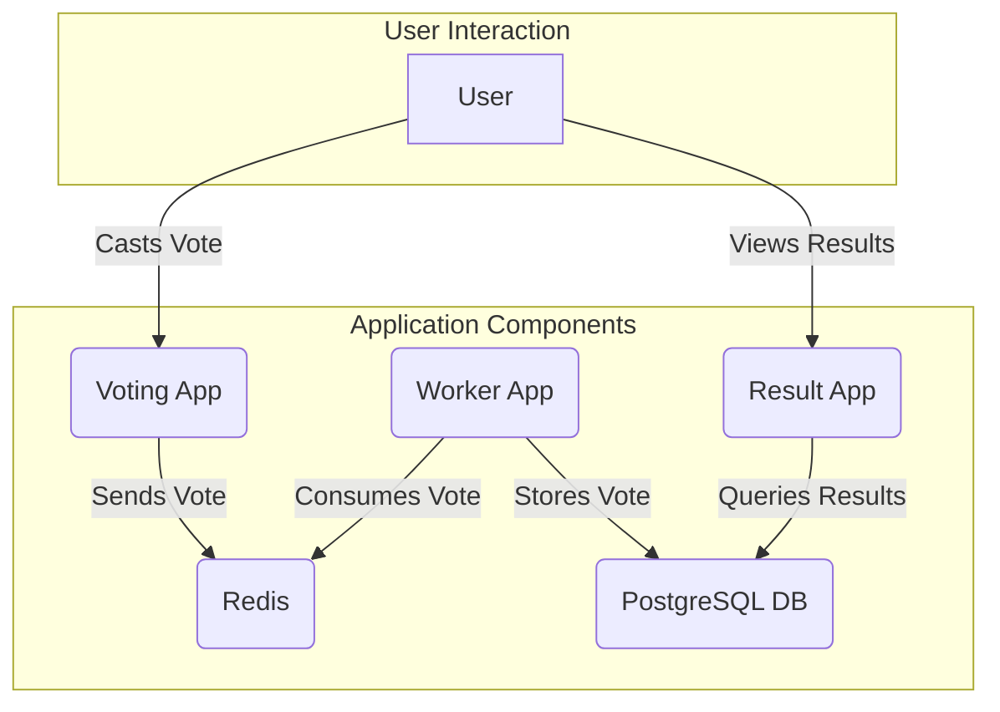

```mermaid
graph TD
    subgraph "User Interaction"
        A[User]
    end

    subgraph "Application Components"
        B(Voting App)
        C(Redis)
        D(Worker App)
        E(PostgreSQL DB)
        F(Result App)
    end

    A -->|Casts Vote| B
    B -->|Sends Vote| C
    D -->|Consumes Vote| C
    D -->|Stores Vote| E
    F -->|Queries Results| E
    A -->|Views Results| F
```