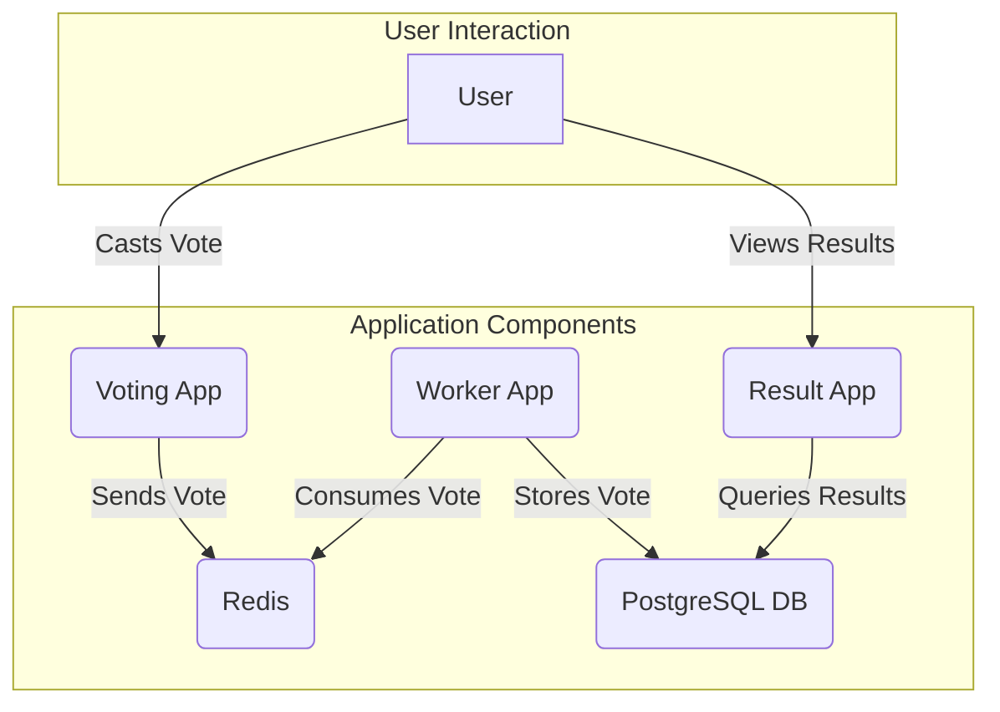

# Voting App Architecture



---

In this project, **StatefulSets** and **Headless Services** are used to manage the stateful components of the application, which are PostgreSQL and Redis. Here's an explanation of each concept and how they work together.

### StatefulSet

A **StatefulSet** is a Kubernetes object used to manage stateful applications. Unlike a Deployment, which treats pods as interchangeable, a StatefulSet maintains a sticky identity for each of its pods. This means:

*   **Stable, Unique Network Identifiers:** Pods created by a StatefulSet have a persistent and unique name, like `postgres-sts-0`, `postgres-sts-1`, etc. This allows other applications to reliably connect to a specific pod.
*   **Stable, Persistent Storage:** Each pod in a StatefulSet gets its own persistent storage volume, which is not deleted when the pod is rescheduled or restarted. This is crucial for databases like PostgreSQL, where data must be preserved.
*   **Ordered, Graceful Deployment and Scaling:** StatefulSets manage pods in a strict order, which is important for applications that require a specific startup or shutdown sequence.

In this project, both PostgreSQL and Redis are stateful applications. They need to store data and have a stable identity, which is why they are deployed using StatefulSets.

### Headless Service

A **Headless Service** is a type of Kubernetes service that does not have a `ClusterIP`. You can see this in the `postgres-sts-service.yaml` and `redis-sts-service.yaml` files with the setting `clusterIP: None`.

Normally, a service gets a single IP address (`ClusterIP`) and load-balances traffic across all the pods it selects. A headless service, on the other hand, does not do load balancing. Instead, when you perform a DNS lookup for the service's name, you get a list of the IP addresses of all the individual pods that the service selects.

### How They Work Together

StatefulSets and headless services are often used together. The headless service provides a way for other applications to discover the individual pods managed by the StatefulSet.

For example, the `postgres-sts-service` allows other services (like the worker app) to find the IP address of the PostgreSQL pod by doing a DNS lookup for `postgres-sts-0.postgres-sts-service`. This provides a stable and reliable way to connect to the database pod, which is essential for a stateful application.

In summary:

*   **StatefulSet** provides the stable pods for PostgreSQL and Redis.
*   **Headless Service** provides the DNS records to discover and connect to those stable pods.

---

### Deployment Instructions

To deploy the application, you can use the Kubernetes manifest files located in the `deployment` directory. It is recommended to use the files in this directory as they use Deployments and StatefulSets, which are more robust for managing applications in Kubernetes.

You can deploy the entire application with a single command:

```bash
kubectl apply -f deployment/
```

Alternatively, you can deploy each component individually. The recommended order is to create the services first, then the deployments and statefulsets.

```bash
# Deploy PostgreSQL
kubectl apply -f deployment/postgres-sts-service.yaml
kubectl apply -f deployment/postgres-sts.yaml

# Deploy Redis
kubectl apply -f deployment/redis-sts-service.yaml
kubectl apply -f deployment/redis-sts.yaml

# Deploy the applications
kubectl apply -f deployment/voting-app-deployment.yaml
kubectl apply -f deployment/worker-deployment.yaml
kubectl apply -f deployment/result-app-deployment.yaml
```

To view the status of your deployments, you can use the following command:

```bash
kubeclt get all
```

To access the applications, you will need to expose the services, for example using `kubectl port-forward` or by creating an Ingress resource.

---

### Deploying with Helm

You can also deploy this application using the Helm chart located in the `/home/catzer/sw_dev/voting-app-uservice/helm/voting-app` directory.

**1. Install the Chart**

To install the chart with the release name `my-release`, run the following command from the chart's root directory:

```bash
helm install my-release .
```

**2. Customize the Installation**

You can customize the installation by modifying the `values.yaml` file or by passing values on the command line. For example, to change the number of replicas to 2, you can run:

```bash
helm install my-release . --set replicaCount=2
```

**3. Upgrade the Release**

To upgrade the release with new configuration, you can use the `helm upgrade` command:

```bash
helm upgrade my-release .
```

**4. Uninstall the Release**

To uninstall the release, run:

```bash
helm uninstall my-release
```